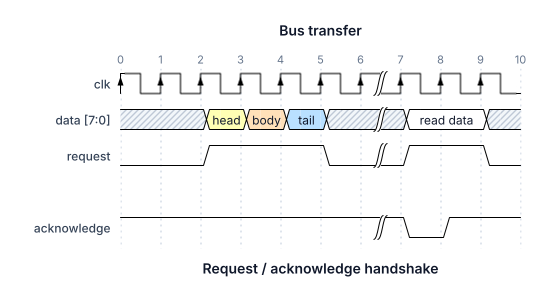
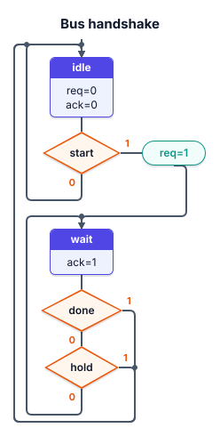
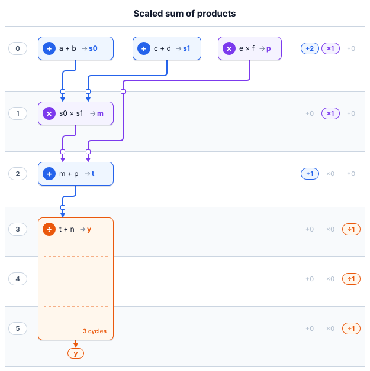
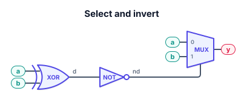

# The Great Wave


`tgw` turns a text file into a compact SVG. One binary draws four pictures. The rendering library has no dependencies.

| First directive | Picture | SVG root class | Example |
| --- | --- | --- | --- |
| `@wvf` | Timing diagram | `class="tgw"` | `examples/transfer.tgw` |
| `@asm` | Algorithmic state machine chart | `class="tgw asm"` | `examples/asm.tgw` |
| `@hls` | High-level synthesis schedule | `class="tgw hls"` | `examples/hls.tgw` |
| `@gtl` | Gate-level netlist | `class="tgw gtl"` | `examples/gtl.tgw` |

The first non-comment directive chooses the picture. `#` is a comment. `//` is not. A file is one picture: do not mix `@wvf`, `@asm`, `@hls`, and `@gtl`. The text describes the picture. It does not store coordinates, wire routes, or operator counts. A timing diagram that omits `@wvf` still renders, and `--convert` writes `@wvf` at the top.

```text
@wvf
@title Bus transfer
@tick 0

clk:         P.....|...
data [7:0]:  x.345x|=.x => head body tail "read data"
request:     0.1..0|1.0
---
acknowledge: 1.....|01.
```



## Writing a file

1. Pick the row in the table above. Put `@wvf`, `@asm`, `@hls`, or `@gtl` on the first non-comment line, alone.
2. Copy the matching example, then replace the names. `@title` and `@footer` work in all four.
3. Check it: `tgw FILE` prints SVG, and `tgw FILE --convert` prints the canonical text. A bad file exits with `path:line:col: message` and a byte offset inside the message from the library.
4. Leave layout to the renderer. Indentation matters only inside `@asm` and `@hls`. A gate netlist ignores indent.

Quotes are the same in all four. A token that contains a space, `#`, a quote, or a backslash is written `"like this"`. Escapes are `\n`, `\r`, `\t`, `\\`, `\"`, `\'`, and `\uXXXX`. Unicode can also be written directly.

## Render

```sh
cargo build --release
./target/release/tgw examples/transfer.tgw -o transfer.svg
./target/release/tgw examples/asm.tgw -o asm.svg
./target/release/tgw examples/hls.tgw -o hls.svg
./target/release/tgw examples/gtl.tgw -o gtl.svg
./target/release/tgw < examples/transfer.tgw > transfer.svg
```

`-i` selects the input. `-o` selects the output. Omit the input, or pass `-`, to read stdin. Omit `-o`, or pass `-`, to write stdout. `--indent 2` pretty-prints the SVG. `tgw --help` lists every flag.

A render refuses to replace the diagram with the SVG. The same path, a symlink, and a hard link are all the same file. On Windows, a different case of the name is the same file too.

## Convert

```sh
./target/release/tgw examples/transfer.tgw --convert
./target/release/tgw examples/asm.tgw --convert
./target/release/tgw examples/hls.tgw --convert
./target/release/tgw examples/gtl.tgw --convert
```

`--convert` reprints a timing diagram starting with `@wvf` and aligned columns, an ASM chart at a 2-space indent, an HLS schedule with every cycle header filled in, and a gate netlist as `@gtl` followed by one gate per line. Supported data is kept. A `#` comment stays with the construct it precedes, including an end-of-line note. `--convert` cannot be combined with `--watch` or `--view`.

## Watch and view

```sh
./target/release/tgw examples/transfer.tgw -o transfer.svg --view   # window and file
./target/release/tgw examples/transfer.tgw --view                   # window only
./target/release/tgw examples/transfer.tgw -o transfer.svg --watch  # file only
./target/release/tgw examples/asm.tgw --view                        # chart, same window
./target/release/tgw examples/hls.tgw --view                        # schedule, same window
./target/release/tgw examples/gtl.tgw --view                        # netlist, same window
```

`--view` opens a window. `--watch` does not. Both keep running, and every save of the input refreshes the picture. With `-o`, the file is refreshed too.

Live mode needs a real input file. `--watch` also needs `-o`. A directory is rejected, and the output directory must already exist.

The output is the same bytes as a one-off render with the same `--indent`. An unchanged save does not rewrite it. A new picture is published by renaming a temporary file into place. When a rename is refused, as when Windows is holding the file open, the picture is written in place. Editors that save by renaming a sibling are followed. The file is also polled five times a second, so a save is still seen on a network drive. On Windows the poll compares names without regard to case, and uses the file index so a replaced file is seen even when the size and timestamp do not change.

A syntax error, a missing file, or a write that fails leaves the last good picture in place. A diagram error is reported as `path:line:col: message`. A write error is the operating-system error. The window shows it in the status bar; `--watch` prints it on stderr. A failed write is tried again at the next poll. Ctrl-W or Ctrl-Q closes the window (Command on macOS). `--watch` stops on Ctrl-C.

In the window, signal names stay fixed. The title, tick numbers, and waveforms scroll together. An `@asm` chart, an `@hls` schedule, or a `@gtl` netlist is the same window with no name column: the whole picture scrolls, and both bars appear when it does not fit. When that picture fits, it is scaled by a whole number so each SVG pixel stays a whole device pixel. When it does not fit, the scale stays 1 and both scrollbars appear.

Use the wheel or trackpad, and hold Shift to scroll sideways. Drag a scrollbar thumb, or click the track to move by most of the view. Bars appear only when the diagram overflows. A diagram that fits is enlarged until it fills the window, with the same small padding on every edge. A short diagram opens in a window snug to the drawing. A later resize is kept, and the extra room becomes padding. A waveform wider than the window scrolls horizontally. A taller diagram scrolls vertically. A tick label that would be cut in half is left out until it fits. `@bounds` still decides which cycles are drawn.

The window follows the system appearance. Default light is the palette written into the SVG. Default dark draws the same diagram in a dark palette. Ctrl-Shift-L (Command-Shift-L on macOS) switches between them and keeps the choice. The saved file stays on the light palette.

The saved SVG stays compact: a long clock is one pattern, and an unknown value is a small hatch pattern. The window paints only the visible slice. It repeats a clock or the grid as strokes. An unknown hatch is a set of continuous slashes, carried through a bus transition, so the marks meet from one side to the other. A bus fill overlaps the edge it shares with that transition, covering the page along the seam.

## Timing diagrams

A file whose first directive is `@wvf` is a timing diagram. `@wvf` takes no arguments. One signal per line, `name: wave`. Names may contain spaces and ranges, as in `data [7:0]`. A blank line is ignored. `---` inserts an empty lane. Indentation does not matter. Do not start the file with `@asm`, `@hls`, or `@gtl`.

Labels come after `=>`, separated by spaces. Quote a label that contains a space, `#`, `;`, a quote, or `=>`.

```text
@wvf
@group Master
  clk:     p....... ; period=2
  address: x3.x4..x => 0x10 0x20 ; phase=0.25
  @group Control
    write: 01.0.... ; node=.a.b....
    read:  0...1..0
  @end
@end

@edge a<->b write pulse
```

A node is one letter in the mask: `.` skips a cycle, and `[setup]` names that one cycle with a word. An uppercase letter is drawn without a label. `@edge setup~>hold "tSU"` connects two names. A missing name or an unknown connector is an error, and the message lists the nodes or the connectors.

`@group Name` and `@end` nest, up to 64 deep. `@group` with no name draws an unlabeled bracket. `@end` closes the nearest group. It is not used in an ASM chart, an HLS schedule, or a gate netlist.

| Option | Effect |
| --- | --- |
| `period=2` | Make each symbol that many cycles long. Must be positive. |
| `phase=0.25` | Shift the signal earlier by a quarter cycle. Negative values start it later. |
| `node=.a.B.[setup].` | Name positions on the wave. One letter is one cycle. `[setup]` is one cycle with a word. `.` skips a cycle. An uppercase letter has no label. |
| `over=1..0` | A colored bar above the lane. `1`–`9` choose the color, `.` continues, `0` ends. |
| `under=2..0` | The same bar below the lane. |

The wave symbols are `p n P N h l H L 0 1 x d u z = 2-9`.

| Symbols | Meaning |
| --- | --- |
| `p` `n` | Clock, rising or falling. |
| `P` `N` | The same clocks, with an arrow on the edge. |
| `h` `l` `H` `L` `0` `1` | High and low levels. `H` and `L` carry an arrow. |
| `x` | Unknown. |
| `d` `u` | Weak low and weak high, drawn dashed. |
| `z` | High impedance, a line at mid level. |
| `=` `2`–`9` | A data bus. The digit selects the color. |
| `.` | Repeat the previous symbol. |
| `\|` | A gap in the trace. |
| `<...>` | Draw the enclosed symbols at half duration. |

Spaces inside a wave are ignored. A clock is at least two half-cycles. A level is at least one. A fractional period still lands on that half-cycle grid, and nodes, bars, and edges follow it.

| Directive | Example |
| --- | --- |
| Title and footer | `@title Bus transfer`, `@footer Figure 1` |
| Tick on each cycle | `@tick 0` |
| Tick between cycles | `@tock 0` |
| Start and step | `@tick 0 0.5` |
| Named ticks | `@tick "idle" "request" "reply"` |
| Footer ticks | `@foot-tick 0`, `@foot-tock 9` |
| Keep every Nth label | `@every 2`, `@foot-every 2` |
| Cycle width | `@scale 2`, an integer from 1 to 100 |
| Drawn range | `@bounds 2 6`, end exclusive |
| Grid | `@grid on`, `@grid off` |
| Edge label size | `@arc-font 12` |
| Gaps along the whole diagram | `@gaps . . 1 . \|` |
| An edge between nodes | `@edge a~>b propagation delay`, `@edge setup~>hold "tSU"` |
| A diagram with no lanes | `@empty` |

Any tick directive accepts `off`. For a numeric series, the first number is the start and the optional second is the step, which also sets the decimal places. A series with step 1 follows `@bounds`. Any other series keeps the start you wrote. Labels are thinned when they would collide, and a series stops at 10,000 labels.

An analog trace is an SVG path. X is in cycles. Y runs from 0 at the low rail to 1 at the high rail. Curves, arcs, relative commands, and exponents are accepted. `period`, `phase`, and `@scale` apply. The stroke stays one pixel wide after scaling.

```text
analog: path M0,0 L1,0 C1.5,0 1.5,1 2,1 H3 A0.5,0.5 0 0 1 4,1 L5,0
```

Register and assign diagrams are not supported.

When generating a timing diagram: start with `@wvf`, then one `name: wave` line per signal, labels only after `=>`, node names only in `node=` or `@edge`, and a `#` comment rather than `//`.

## ASM charts

A file whose first directive is `@asm` is an algorithmic state machine chart. Indentation matters only in this file. `#` comments, `@title`, and `@footer` work as they do on a timing diagram. `@end` is not used. `--convert` reprints the chart at a 2-space indent.

`examples/asm.tgw`:

```text
@asm
@title Bus handshake

idle:
  req=0
  ack=0
  ? start
    0 idle
    1 (req=1) wait

wait:
  ack=1
  ? done
    0 ? hold
      0 wait
      1 idle
    1 idle
```



`name:` at column 0 opens a state. The name is a bare token, or a quoted string when it contains a space or `:`. Lines under the state, in order:

1. Moore outputs, one line each, such as `req=0`. These come before any exit. A state box holds at most 32 lines.
2. One exit. `> next` links straight to `next`. `? condition` is a decision and replaces that one exit. A state with no exit is terminal.

A decision has exits `0` and `1`, in either order, at the same indent, one step deeper than the `?` line. `0` continues down. `1` leaves to the right. Each exit is a state name or a nested `?`:

```text
? start
  0 idle
  1 (req=1) wait
```

`1 (req=1) wait` draws a conditional-output box on that exit, then links to `wait`. The parentheses are required around the condition output. A nested decision takes the place of the state name:

```text
0 ? hold
  0 wait
  1 idle
```

Blocks stack in source order. A state is a card with its name in a coloured header and its outputs below. A decision is an amber diamond with `0` and `1` beside its exits. A conditional output is a teal pill. A link into the state directly below is a straight arrow. Any other link runs in a side channel: forward on the right, back on the left. Exits from one state to the same target share one drop column and one channel, and a dot marks where they join. Wires are rounded and end in an arrowhead on the target's entry. The text does not carry coordinates, column numbers, or arrow routes.

Caps: 256 states, 32 lines in one state box, 32 nested decisions. A second exit on a state (`> a` and `> b`, or `>` plus `?`) is an error. A decision that lacks `0` or `1`, repeats one of them, or indents the two exits differently is an error. An unknown target lists the state names. A directive after the first state is an error (`directives belong before the states`).

When generating a chart: start with `@asm`, put every state name at column 0, indent outputs and the exit, indent `0` and `1` one level under `?`, and give every decision both exits. Two spaces per level is the canonical indent.

## HLS schedules

A file whose first directive is `@hls` is a high-level synthesis schedule. Time runs down. A horizontal rule is a clock edge, and the band under that rule is one cycle. Cycle `0` is the top. Operators in one band run in the same cycle. Indentation matters only in this file. `#` comments, `@title`, and `@footer` work as they do on a timing diagram. `@end` and `@asm` are not used.

`examples/hls.tgw`:

```text
@hls
@title Scaled sum of products

0:
  + a b -> s0
  + c d -> s1
  * e f -> p
1:
  * s0 s1 -> m
2:
  + m p -> t
3:
  / t n -> y !3
```



Cycle `0` uses two adders and one multiplier. Cycle `1` multiplies `s0` and `s1`; `p` is carried through that cycle because nothing reads it yet. Cycle `2` adds `m` and `p`. Cycle `3` starts a divider that stays busy for three cycles, so cycles 3, 4, and 5 each count one divider, and `y` is ready at the end of cycle 5. No operator reads a value written in the same cycle.

A cycle header is `N:` at column 0. Numbers start at 0, increase, and have no leading zeros. A missing number is still drawn, as an empty band whose usage is `+0 ×0 ÷0`. An operator is indented under the cycle it starts in. Canonical indent is two spaces.

| Line | Unit |
| --- | --- |
| `+ a b -> s0` | Adder. |
| `* e f -> p` | Multiplier. |
| `/ t n -> y` | Divider. |

The two operands are names or integer constants, including negatives (`-2`). The name after `->` is the result. `!N` keeps that unit busy for N cycles, this cycle and the next N−1, and the usage count of each of those cycles includes it. Its card spans those bands, with a dashed line at each clock edge it crosses and `N cycles` in its corner. Omit `!N` when the unit lasts one cycle. `!1` is accepted and `--convert` drops it. `--convert` writes `!N` only when N is not 1, and it prints every cycle header from 0 through the last busy cycle, including gaps and the empty tail of a multi-cycle unit.

A name that is not yet a result is a primary input (`a`, `b`, `n` in the example). A result becomes readable at cycle `start + N`. Using it earlier, or using a result as its own operand, is an error: `result "s0" is not ready until cycle K; results are ...`. Defining the same result twice is `duplicate result "s0"`. A token in the operand position that is `+`, `*`, `/`, `->`, or starts with `!` is an unknown operand, and the message lists the results defined so far.

Each band has its cycle number in the left gutter and a usage column on the right: `+a`, `×m`, and `÷d` count cards of that kind whose lifetime covers the cycle, including a unit that started earlier and is still busy. A nonzero count is a pill in that kind's colour; a zero is greyed out. The usage is computed. Do not write it in the file.

A card is coloured by its unit: blue for an adder, violet for a multiplier, orange for a divider. It shows the operation glyph, the expression (`a + b`, `s0 × s1`, `t ÷ n`), and `→` the result.

A result used later is a wire in the producer's colour from the bottom of its card to an arrowhead on that operand's port: the left operand enters a third of the way across the consumer, the right operand two thirds. In the routing zone under each row of cards, every result gets its own horizontal track. A value read more than one cycle later drops through its own lane in the gap beside the consumer, so no two wires share a run and no wire passes through a card. A small square marks each clock edge a wire crosses: one register per cycle the value is held. A dot marks where one result branches to several readers. A result that never appears again is a live-out: an arrow under its card ends in a pill with its name.

Caps: 64 cycles, 32 operators started in one cycle, 256 operators in the file. A latency that would pass cycle 63 is an error. Cycle numbers that do not increase are an error. A cycle header that is indented is `a cycle header starts at column 0`. An operator before any cycle is `an operator belongs to a cycle`. `@hls` takes no arguments. A directive after the first cycle is `directives belong before the cycles`.

When generating a schedule: one short line per operator, both operands, a fresh result name, and `!N` only for a unit that stays busy. Order the cycle headers from 0 upward. Do not chain two operators in the same cycle. Do not store coordinates or the usage counts.

Quoted names and constants:

```text
@hls
0:
  + "go on" b -> "out put"
1:
  * s -2 -> p
```

An unquoted integer is a constant. A quoted integer is a name, so `"1"` is not the constant `1`.

## Gate netlists

A file whose first directive is `@gtl` is a gate-level netlist. Signals run left to right. Each gate is its distinctive-shape symbol (`AND`, `OR`, `XOR`, a `NOT` triangle, a `MUX` trapezoid) with its function written inside. `NOT`, `NAND`, `NOR`, and `XNOR` end in an inversion bubble. Inputs land on the left, top to bottom in source order; a mux takes its data inputs on the left, marked `0` and `1`, and its select from below. The output leaves on the right. A name that no gate writes is a primary input: a teal pill on a short stub. An integer tie-off is a grey pill. A result that no gate reads is a live-out: a red pill on the right. Every other result is named in small text on its wire. A gate slides down its column to line its input up with the gate that drives it, so a chain is one straight line. A later gate reads an earlier result through a rounded orthogonal wire with its own track in the gap between columns. A wire that skips columns runs straight across when its row is clear, and otherwise steps to the nearest free row. A dot marks where one net branches. Indentation does not change the picture. `#` comments, `@title`, and `@footer` work as they do on a timing diagram. `@end`, `@asm`, `@hls`, and `@wvf` are not used.

`examples/gtl.tgw`:

```text
@gtl
@title Select and invert

xor a b -> d
not d -> nd
mux nd a b -> y
```



`xor` and `not` form a chain. `mux` takes the select first (`nd`), then the two data inputs (`a`, `b`). `y` is the live-out. `a` and `b` are primary inputs.

Each gate line is `kind inputs -> output`. The kind decides how many inputs are legal. The parser asks the kind, so the line is not fixed at two operands. The owned model stores `inputs` and `outputs` as lists. Every kind has one output today. A later kind with more ports is a new kind and a new count, not a new placer.

| Kind | Inputs | Output |
| --- | --- | --- |
| `and`, `or`, `xor` | two | one |
| `nand`, `nor`, `xnor` | two, and an inversion bubble on the output | one |
| `not` | one, and an inversion bubble on the output | one |
| `mux` | select, then two data inputs | one |

`not a -> y`. `mux s a b -> y`. `and a b -> y`. Operands are names or integer tie-offs (`0`, `1`, `-1`). A quoted integer stays a name, so `"1"` is not the constant `1`. Quotes and escapes match timing labels.

A result used before it is defined, including a loop or a gate that reads its own output, is an error, and the message lists the results defined so far. Defining the same result twice is `duplicate result "y"`. An unknown kind lists `and, or, not, nand, nor, xor, xnor, mux`. The wrong number of inputs names the count that kind takes.

`--convert` reprints `@gtl`, then the title and footer, then one gate per line in source order. Extra indent is dropped.

Caps: 256 gates, logic depth 64, and 8 inputs or 8 outputs on one gate. Depth is one forward walk: a gate's column is one past the deepest gate that drives it, and primary inputs are not gates. `@gtl` takes no arguments. A directive after the first gate is `directives belong before the gates`.

When generating a netlist: one short line per gate, the kind's inputs in port order, and a fresh result name. Do not store coordinates or wire routes.

## Picture

Bus transitions cross at the same point, and a label is centered on the visible part of its value. A gap clears the trace underneath it. Each SVG has a title, a description, and paint ids that belong to that document only. There is no global stylesheet, so several diagrams can sit on one page.

A long clock is one shared pattern. A long hold is one stroke. `@bounds` drops geometry outside the window, including annotations, instead of emitting it and hiding it. `render_into` reuses the caller's buffer. Text is measured against a conservative sans-serif, so a label's exact width can differ slightly by platform.

ASM boxes, HLS cards, and every pill sit on a pixel grid. Text plus padding is snapped outward to 4px. A border is a filled rounded rectangle with its fill inset by 1px, so a 1px edge stays on whole pixels. HLS cycle rules are 1px filled rectangles. A wire in a chart, a schedule, or a netlist is a 2px stroke centred on whole-pixel coordinates, so each straight run covers exactly two pixel rows or columns at any whole-number scale; only its rounded corners, gate outlines, diamonds, bubbles, dots, and text are antialiased. Both palettes have a dark twin for the window. The root transform is `translate(8,8)`.

```sh
cargo run --release --example long_wave
```

That example reports median and p95 render times and SVG sizes for long signals.

## Library

```rust
let svg = tgw::render("@wvf\nclk: P...\ndata: x3.4 => ready done")?;
let mut buffer = Vec::new();
tgw::render_into("@wvf\nclk: p...", &mut buffer)?;
let editable = tgw::to_tgw("clk: p...")?;
# Ok::<(), tgw::Error>(())
```

`render`, `render_into`, and `to_tgw` accept all four pictures. `render_opts` indents the SVG. `render_themed` takes `scheme::LIGHT` or `scheme::DARK`. `render` and `render_opts` always write `scheme::LIGHT`, which is also the palette of a saved file. On error the output buffer is cleared. Invalid paths, excessive nesting, non-finite timing, and out-of-range geometry return `Error` with a byte offset and a message.

A program that only renders can depend on the library with `default-features = false`.

## Builds

| Command | What you get |
| --- | --- |
| `cargo build --release` | Renderer, `--watch`, and `--view` |
| `cargo build --release --no-default-features --features watch` | Renderer and `--watch`, no GUI libraries |
| `cargo build --release --no-default-features` | Renderer only, no dependencies |

`tgw --help` says when a flag is missing from the build. The window uses [GPUI](https://www.gpui.rs/). `rust-toolchain.toml` pins the compiler.

## Platforms

- **macOS.** The Dock shows the tgw icon while a window is open.
- **Windows.** The icon is embedded in `tgw.exe` for Explorer, the taskbar, and the title bar. That needs the Visual Studio resource compiler, or `windres` for the GNU toolchain. Without one, the build warns and continues. CRLF sources render the same picture as LF. A sharing or lock violation while an editor is still saving is treated as transient, and the next poll reads the finished file.
- **Linux.** The window runs on Wayland or X11. With neither `WAYLAND_DISPLAY` nor `DISPLAY` set, `--view` exits and names `--watch` as the alternative. Building the window needs:

```sh
sudo apt install pkg-config libxkbcommon-dev libxkbcommon-x11-dev libwayland-dev \
  libxcb1-dev libx11-xcb-dev libfontconfig-dev libfreetype-dev
```

X11 takes the icon from the binary. Wayland looks up the desktop entry:

```sh
cargo install --path .
install -Dm644 assets/linux/tgw.desktop ~/.local/share/applications/tgw.desktop
install -Dm644 assets/icon/tgw.svg ~/.local/share/icons/hicolor/scalable/apps/tgw.svg
```

## Icon

`assets/icon/tgw.svg` is the master: a square pulse that becomes Hokusai's wave. The Dock PNG and the Windows ICO are generated from it.

```sh
cargo run --example icon
```

## Checks

```sh
cargo fmt --check
cargo clippy --locked --all-targets -- -D warnings
cargo clippy --locked --all-targets --no-default-features --features watch -- -D warnings
cargo clippy --locked --all-targets --no-default-features -- -D warnings
cargo test --locked
cargo test --locked --no-default-features
cargo test --locked --no-default-features --features watch
cargo test --locked --no-default-features --release
cargo test --locked --test watch -- --ignored   # opens a window
cargo doc --locked --no-deps
cargo build --locked --release
```

The three Clippy lines, and the matching tests, are the default build, the headless watcher, and the renderer alone. The renderer is also tested in release. The default `cargo test --locked` and the release run include the 1:1 screenshot checks for ASM charts, HLS schedules, and gate netlists.

`tests/fixtures` holds diagrams and their SVG snapshots. The original eight timing diagrams must render the same picture under CRLF. Further snapshots cover the wave alphabet, fractional ticks, period and phase, markup, Unicode, a cropped bus, SVG paths, an empty diagram, and nested groups. `tests/fixtures/asm/`, `tests/fixtures/hls/`, and `tests/fixtures/gtl/` hold one edge case per file, plus `tests/fixtures/asm.tgw`, `tests/fixtures/hls.tgw`, and `tests/fixtures/gtl.tgw`. `tests/watch.rs` drives the real binary through in-place saves, a broken save, deletion, and a rename, then through every edge-case picture, including the chart, the schedule, and the netlist, for `--watch` and, when ignored tests run, for `--view`. The window tests also slice and raster those pictures the way the viewer does.

```sh
UPDATE_SNAPSHOTS=1 cargo test --test render snapshots
```

Browser QA is optional and uses a Playwright install that is not part of the Rust build:

```sh
node scripts/visual-check.cjs /tmp/tgw-visual
```

Set `PLAYWRIGHT_MODULE` and `BROWSER_EXECUTABLE` when they are not on the default paths. The script checks SVG references and text bounds, then saves 1× and 2× screenshots.

## License

The Great Wave is released under the MIT License. Copyright (c) 2026 eaSyMaxSU.

Wave rules, lane semantics, and the default bus palette originate in [WaveDrom](https://wavedrom.com/) by Aliaksei Chapyzhenka (Copyright 2011–2026), which is MIT licensed ([source](https://github.com/wavedrom/wavedrom)). SVG arc geometry follows the [SVG 2 arc implementation notes](https://www.w3.org/TR/SVG2/implnote.html#ArcImplementationNotes).
